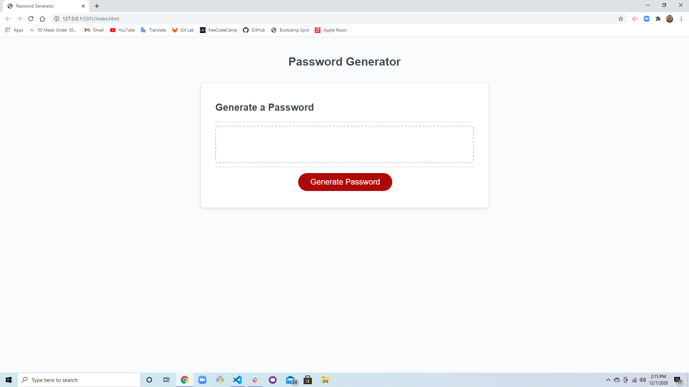
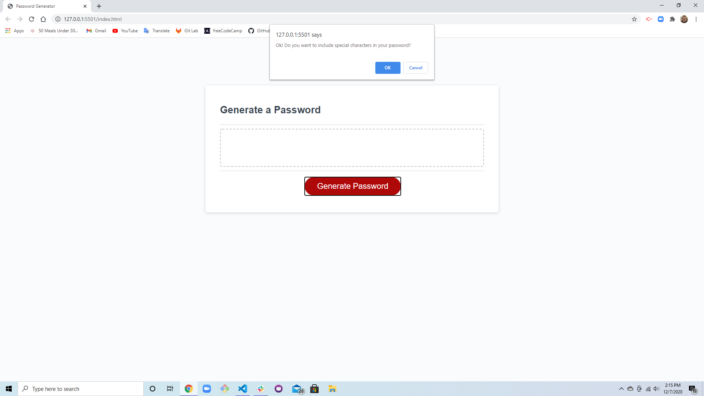

# Homework-Week3
Screenshots: 

Description:

First I started off creating my arrays for my special characters, uppercase letters, lowercase letters, and numbers. I then declared all of the variables that I used throughout this application and started my first function that generates the actual password off of the user's input. I did this by multiple if, else if, and else statements. If the user puts in a number less than 8 or higher than 128, then they will be returned with an alert saying to choose a correct number. Once they do, they will then be alerted with confirm variables choosing what kind of characters they want in their password. If they don't choose any variables to put into their password, then they'll be alerted to choose at least one. I then created an object to store this input and a function that will get that random element into an array. I created two for loops to get that random password from the inputs chosen and place them into a string to then be pushed inside the text box on the screen. We were provided the writePassword function and the addEventListener for the click on the Generate Password button. 

Link to Deployed Application: 

https://todtsies.github.io/Homework-Week3/.